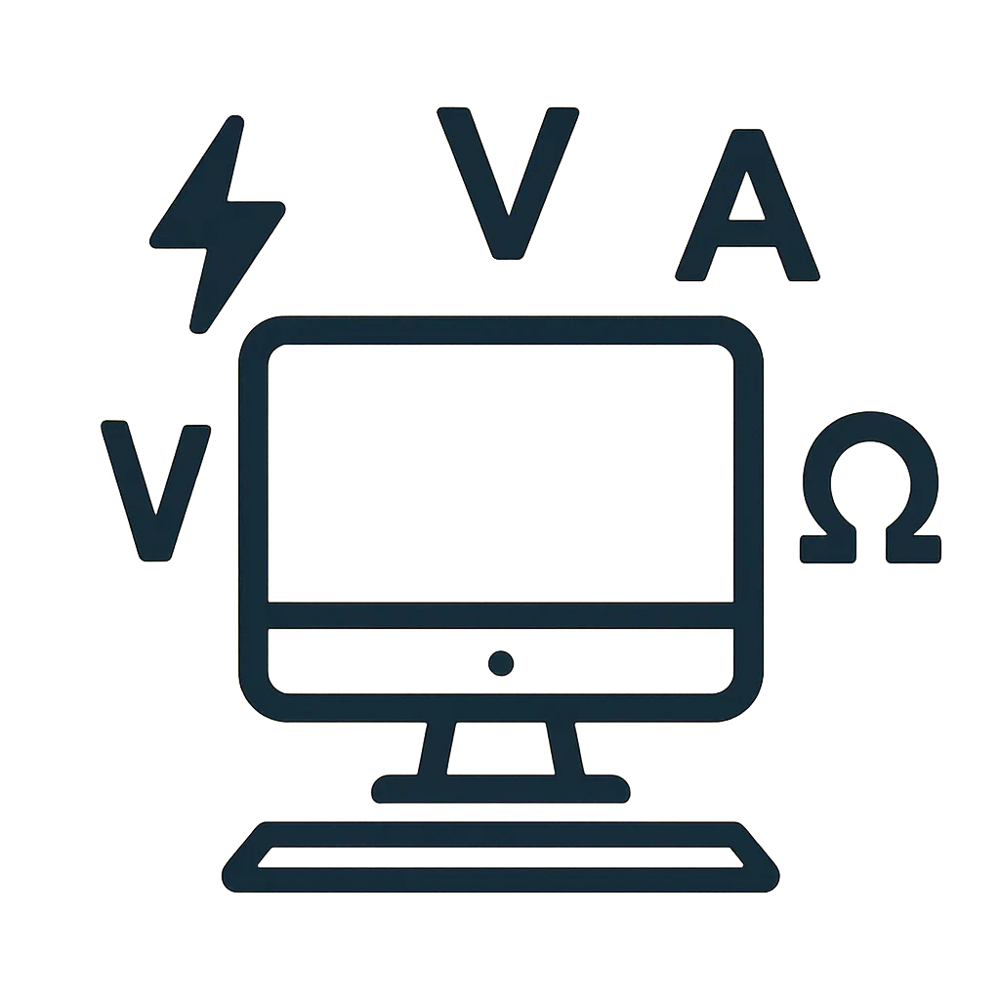
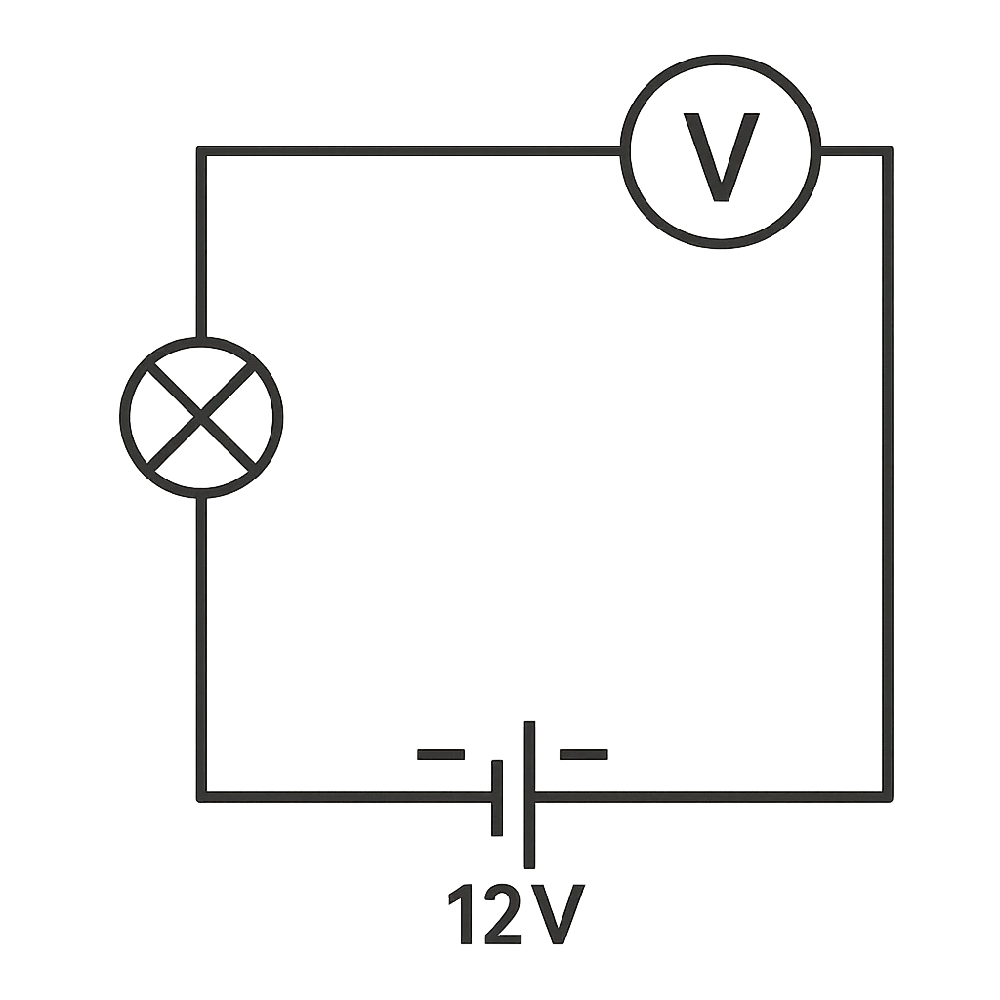
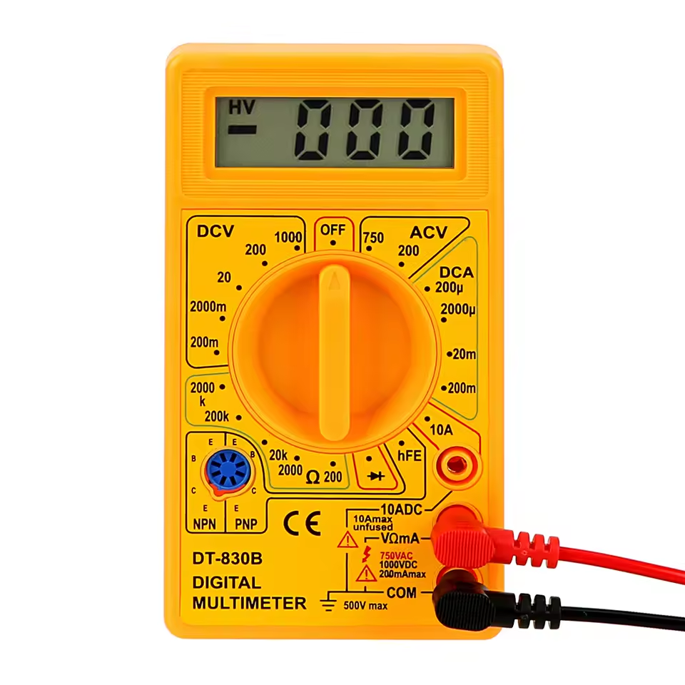
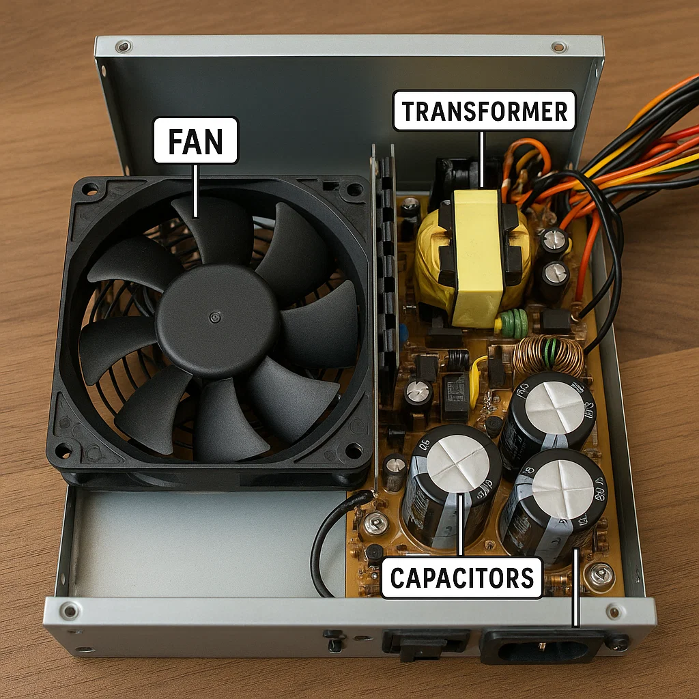
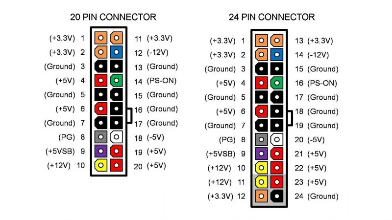
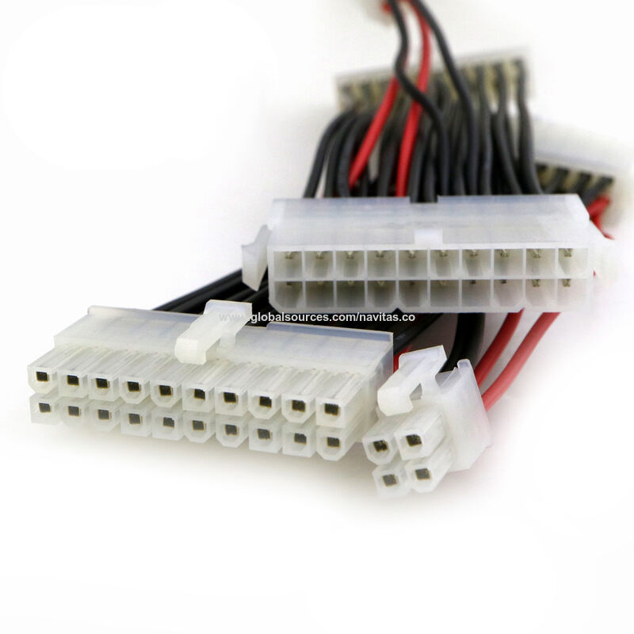

# 0221 — Muntatge i
# Manteniment d’Equips  

 

## Electricitat a l’ordinador
## Components d’un equip

Note:
Objectius: entendre magnituds elèctriques bàsiques, fonts ATX i SAI; PRL i medi ambient. Identificar unitats funcionals, placa base i perifèrics. Hi ha activitats amb correcció automàtica en cada bloc.

---
# Electricitat a l’ordinador
### Mesures elèctriques i fonts d’alimentació

  

<!-- [IMATGE: icona estil pla d’un ordinador de sobretaula amb símbols elèctrics (llamp, V, A, Ω) flotant al voltant] -->

Note:
Aquest bloc ens introdueix a l’electricitat aplicada als ordinadors.  
La idea és que entengueu com funcionen les fonts d’alimentació i com utilitzar el multímetre per mesurar tensions i intensitats.  
És la base per després poder diagnosticar errors de maquinari: si un ordinador no encén, moltes vegades el problema és d’alimentació.  

--

## Magnituds elèctriques bàsiques
- **Tensió (V):** diferència de potencial
- **Intensitat (A):** flux de càrregues
- **Resistència (Ω):** oposició
- **Potència (W):** energia / temps
- Exemple: bombeta 12V, 5W

  

<!-- [IMATGE: esquema senzill amb una bateria de 12V connectada a una resistència/bombeta i un voltímetre en paral·lel] -->

Note:
- La **tensió** és com la pressió de l’aigua dins una canonada: com més pressió, més força per empènyer els electrons.  
- La **intensitat** és com el cabal d’aigua: la quantitat que circula pel circuit.  
- La **resistència** és l’oposició al pas, com si fos un tub estret.  
- La **potència** és l’energia total utilitzada. Exemple: una bombeta de 12V i 5W consumeix 0,42A (I = P/V).  
Remarca que aquests conceptes els veurem sovint quan diagnostiquem equips.  

--

## Multímetre: funcions principals
- Mesura de **V** (AC/DC)
- Mesura de **A**
- Mesura de **Ω**
- **Prova de continuïtat**
<!-- [IMATGE: multímetre digital groc i negre, pantalla mostrant "12.00 V", amb selector marcat a V i cables de prova vermell i negre] -->

  

Note:
El multímetre és l’eina més bàsica d’un tècnic.  
- Sempre tenim dos cables: el **negre (COM)** i el **vermell (VΩmA)**.  
- Amb ell podem comprovar si una font ATX dóna tensió, si un cable està trencat o si un component condueix.  
- La funció de **continuïtat** és molt útil: fa un “pip” si el circuit està connectat. Això ens ajuda a comprovar cables ràpidament.  

--

## Com connectar el multímetre
- **Tensió → paral·lel**
- **Intensitat → sèrie**
- **Resistència → circuit apagat**
- Exemple: mesura de pila AA
<!-- [IMATGE: dos esquemes dibuixats: 1) voltímetre en paral·lel amb una pila i una bombeta; 2) amperímetre en sèrie trencant el circuit i intercalant l’aparell] -->

Note:
És molt important col·locar el multímetre correctament:  
- Per mesurar **tensió**, posem el multímetre en paral·lel amb el component.  
- Per mesurar **intensitat**, cal tallar el circuit i posar el multímetre enmig.  
- Per mesurar **resistència**, el circuit ha d’estar apagat, sinó les lectures seran falses o podem fer malbé el multímetre.  
Exemple pràctic: mesurar la tensió d’una pila AA.  

--

## Fonts ATX: introducció
- Converteix AC (230V) → DC (12V, 5V, 3.3V)
- Components: ventilador, filtres, condensadors
- Seguretat: no obrir una font ATX
<!-- [IMATGE: fotografia realista d’una font ATX oberta, amb el ventilador, transformador i condensadors visibles i etiquetats] -->

  

Note:
Els ordinadors no funcionen amb la corrent de casa (230V AC).  
Necessiten corrent contínua a diferents tensions: 12V, 5V i 3.3V.  
La font ATX fa aquesta conversió.  
Dins hi trobem transformadors, condensadors i un ventilador.  
**Seguretat**: no obrir mai una font ATX, perquè els condensadors poden quedar carregats i donar descàrregues fins i tot desconnectada.  

--

## Rails de sortida
- **+12V:** CPU, GPU, discs
- **+5V:** circuits antics
- **+3.3V:** RAM i xipset
- **PWR_OK:** senyal correcte
- **PS_ON#:** activació des de la placa

### Connectors de 20 i de 24 pins

  
  

<!-- [IMATGE: diagrama connector ATX de 24 pins, cada cable de color amb l’etiqueta (+12V groc, +5V vermell, +3.3V taronja, GND negre, PS_ON# verd, PWR_OK gris)] -->

Note:
La font ATX té diversos “rails”:  
- El **+12V** alimenta CPU, targeta gràfica i motors de discs.  
- El **+5V** es feia servir per circuits antics i perifèrics.  
- El **+3.3V** alimenta memòries i circuits moderns.  
El pin verd (PS_ON#) permet a la placa base engegar la font.  
El pin gris (PWR_OK) confirma que la tensió és estable.  

--

<!-- ## Eficiència energètica
- **Eficiència = P sortida / P entrada**
- Menys calor i consum
- Certificats **80 PLUS**
[IMATGE: gràfic simple amb una corba d’eficiència mostrant entre 80-90%, i logos 80 PLUS Bronze, Silver, Gold, Platinum]

Note:
No totes les fonts són iguals: una de 500W barata pot gastar molt més que una de certificada.  
Si una font té un 80% d’eficiència, per donar 400W al PC consumirà 500W de la xarxa, i 100W es perden en calor.  
Les certificacions 80 PLUS garanteixen eficiència mínima del 80%. Hi ha nivells: Bronze, Silver, Gold, Platinum… com més alt, més rendiment i menys consum.  

-- -->

## Càlcul de potència
- Fórmula: **P = V × I**
- Exemple: HDD 12V × 0,5A = 6W
- Fonts habituals: 300W, 500W, 750W…
<!-- [IMATGE: taula amb components de PC (CPU, GPU, HDD, RAM) i consum típic en W] -->

Note:
Abans de muntar un ordinador hem de calcular el consum total.  
Exemple: un disc dur que consumeix 0,5A a 12V → 6W.  
Les fonts ATX es venen amb potències diferents: 300W, 500W, 750W…  
Sempre recomanem deixar un **marge del 20–30%** perquè la font no vagi al límit i tingui més vida útil.  

--

## Exercici pràctic
Calcula el consum total d’un ordinador amb:
- CPU: 95W
- GPU: 200W
- 2 HDD: 12W
- Altres: 40W
→ Recomana una font adequada
<!-- [IMATGE: icones estil pla d’un ordinador amb CPU, GPU, 2 discos i perifèrics, cadascun amb etiqueta de consum en W] -->

Note:
Fem el càlcul pas a pas:  
- CPU: 95W  
- GPU: 200W  
- 2 HDD: 2 × 6W = 12W  
- Altres: 40W  
**Total: 347W**.  
Amb un marge de seguretat, recomanem una font d’almenys 500W.  

---

## Resum del bloc
- Multímetre i mesures
- Magnituds elèctriques
- Fonts ATX i rails
- Eficiència i potència

Note:
En resum, hem après:  
- Com funciona i s’utilitza el multímetre.  
- Quines són les magnituds elèctriques bàsiques.  
- Com són i què fan les fonts ATX.  
- La importància de l’eficiència i de calcular bé la potència d’un PC.  
Amb aquesta base podrem afrontar problemes d’alimentació i fer diagnòstics més segurs.

---

**Activitat (lliurable)**  
<a href="activitats/electricitat/activitat.html" target="_blank">Obrir activitat: Electricitat</a>

---
<!-- ## Electricitat
### 2. Sistema d’alimentació ininterrompuda (SAI)
- Tipus: offline / line-interactive / online.
- Dimensionament per VA i autonomia.
- Escenaris d’ús.

**Activitat (lliurable)**  
<a href="activitats/sai/activitat.html" target="_blank">Obrir activitat: SAI</a>

---
## Electricitat
### 3. PRL i protecció ambiental
- Riscos elèctrics i EPI.
- Bones pràctiques al taller.
- RAEE, piles i bateries.

**Activitat (lliurable)**  
<a href="activitats/riscos/activitat.html" target="_blank">Obrir activitat: PRL i Medi Ambient</a>

---
## Bloc 2 · Components d’un equip microinformàtic
### 1. Sistemes informàtics i unitats funcionals
- Von Neumann: UM, UC, UAL, E/S.
- Maquinari vs programari.

**Activitat (lliurable)**  
<a href="activitats/unitats_funcionals/activitat.html" target="_blank">Obrir activitat: Unitats funcionals</a>

---
## Bloc 2 · Components
### 2. Placa base: components i configuració
- Socket, chipset, BIOS/UEFI.
- Slots RAM, PCIe, M.2, ports.

**Activitat (lliurable)**  
<a href="activitats/placa_base/activitat.html" target="_blank">Obrir activitat: Placa base</a>

---
## Bloc 2 · Components
### 3. Perifèrics i comunicacions
- Entrada/sortida/emmagatzematge/comunicació.
- Ports: USB, HDMI, RJ-45, àudio.

**Activitat (lliurable)**  
<a href="activitats/periferics/activitat.html" target="_blank">Obrir activitat: Perifèrics</a>

--
## Tancament
- Lliura tots els JSON al Moodle.
- Dubtes? Anotem incidències per millorar la pràctica.

Note:
Recordatori: penalització visible en reintents a l’HTML; la nota oficial la calcula `corregeix.py` amb totes les entregues. -->